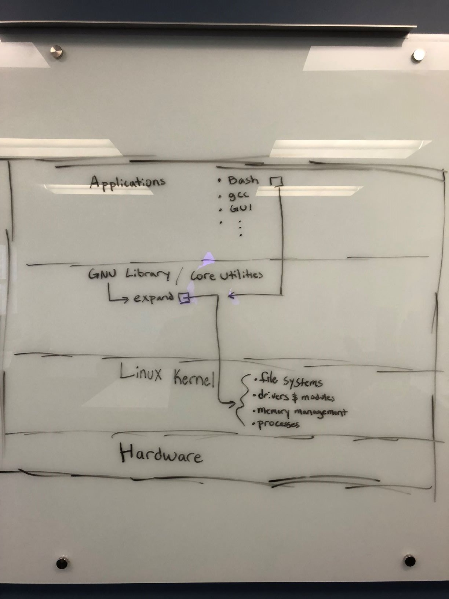

# 387Project

Project for OS with Dr. Professor. BJ Johnson
Thomas Ochsner, Kevin Peters, & Mike Justus West

## Preliminary Design

### 1.1

We are going to modify the `mousedev` and `keydev` modules so that when no keyboard is detected, users can move the cursor using the arrow keys and click with nearby keys. If at anytime a mouse _is_ detected by the OS, the module will stop to re-allow normal usage of the arrow keys. In similar fashion, once the mouse is removed, the module will reactivate.

### 1.2

We feel that this adds some niche functionality. If a user ever finds themself without a working mouse or trackpad, this module allows them to still use their machine. It is common for specialized Linux machines (eg: servers) to run without any standard I/O. In these cases, in the rare event physical I/O must be used, the option to only use a keyboard may prove useful in making time-sensitive repairs/changes.

### 1.3 Modules that may need to be modified

- input
- mousedev
- keydev
- usbcore
- uhci_hcd or ohci_hcd or ehci_hcd
- usbhid

### 1.4

Not Applicable. We only need to modify existing modules.

## Detailed Desgin

### 2.1

- expand.c
- expand-common.c
- expand-common.h

### 2.2

Not Applicable. Our project will be alterting the existing `expand` command so that its default behavior is to overwrite the source file with the converted version.

### 2.3 Diagram

### 2.4

Ubuntu Linux by default has the `expand` command as part of the GNU Coreutils that are included with the distribution. We will be using the [existing documentation for expand.c](https://www.gnu.org/software/coreutils/manual/html_node/expand-invocation.html#expand-invocation), with the only difference being the default output behavior. In its standard form, the command outputs to `STDOUT`, but in our version we will have commmand overwrite the source file. In essence, we will be simulating running `expand FILE_NAME > FILE_NAME`, but without the need for directing the output. Not only is this convient, but it adds the utility so that running expand with a selector, such as `expand *.c`, could be used to convert a large amount of files at once. This cannot be easily replicated using the `>` operator in bash, since it requires a specified target file.
